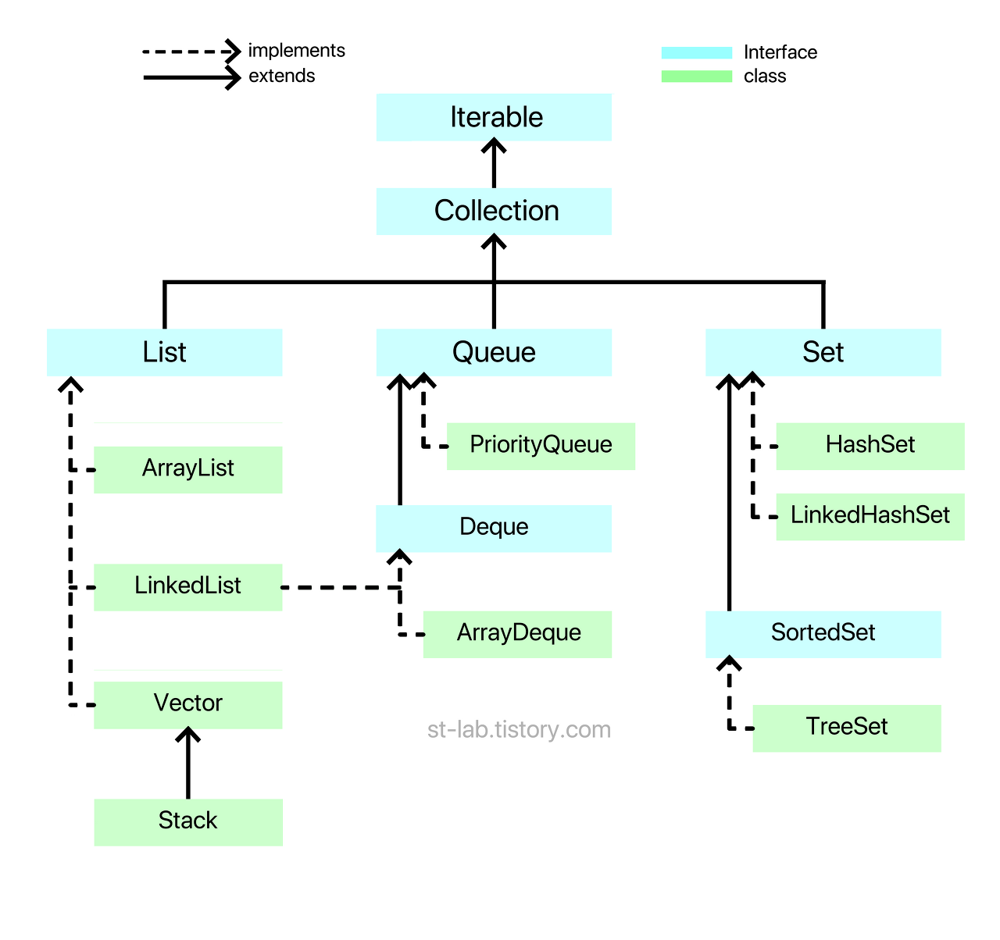
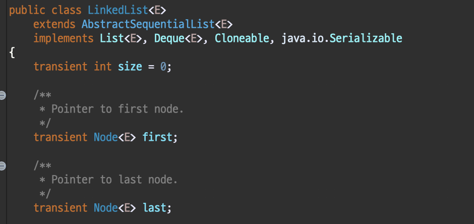
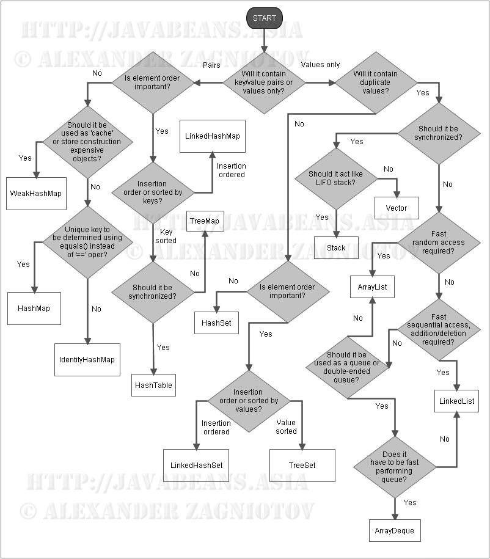
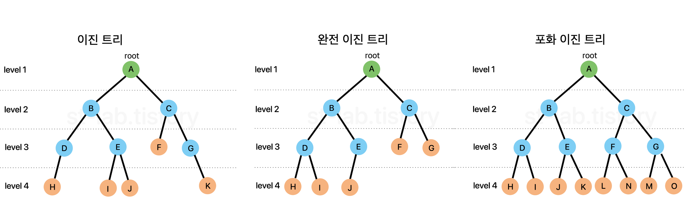
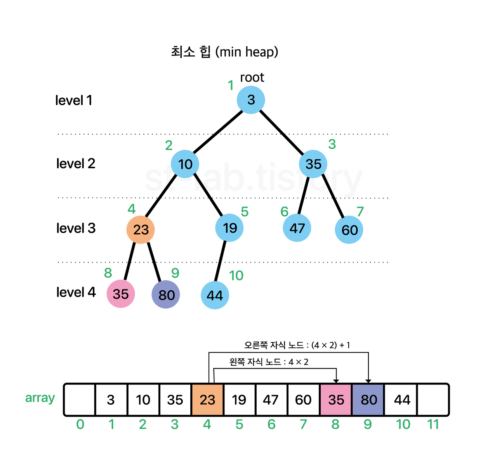
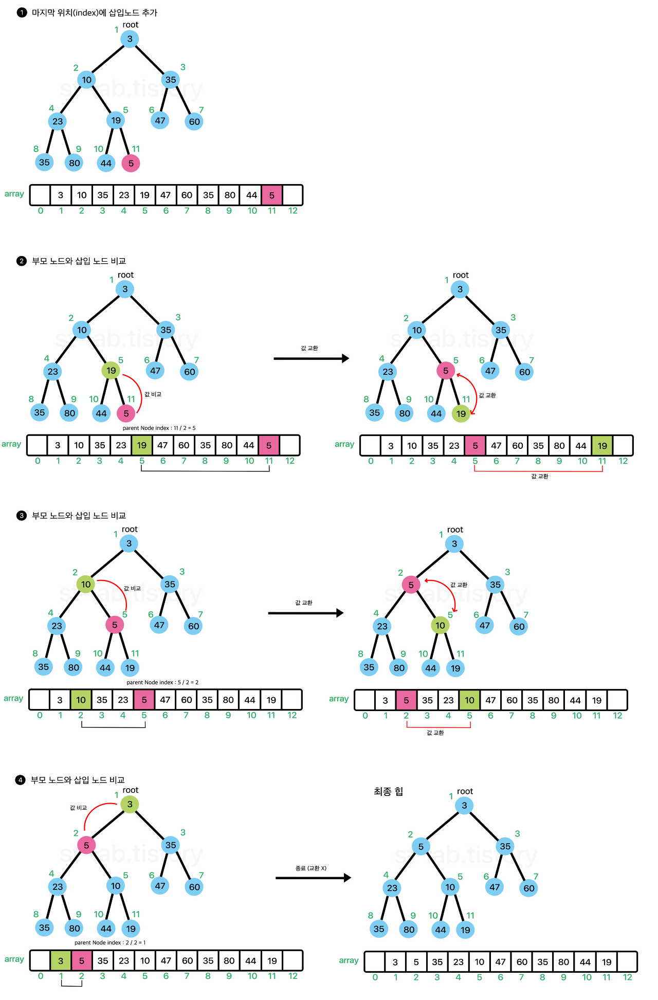

# 자료구조

---

## 자바 컬렉션 프레임워크

- 비슷한 종류의 데이터들을 쉽게 다루기 위해 모아놓은 것들을 가종 및 처리할 수 있도록 지원.

---

## 자료구조의 분류법

### 형태에 따른 자료구조 분류

- 선형 자료구조(Linear Data Structure)
    1. 리스트(List)
    2. 큐(Queue)
    3. 덱(Deque)
- 비선형 자료구조(Nonlinear Data Structure)
    1. 그래프(Graph)
    2. 트리(Tree)

### 기타 자료구조

- 집합 자료구조
    1. 집합(Set)
- 파일 자료구조
    1. 순차파일
    2. 색인파일
    3. 직접파일



---

## List Interface

### 리스트 인터페이스를 구현하는 클래스

- ArrayList
- LinkedList
- Vector(+Vector 를 상속받은 Stack)

### 리스트 인터페이스에 선언된 메소드

- add() : 요소 추가
- remove() : 지정한 객체와 같은 첫번째 객체 삭제
- contains() : 지정한 객체가 컬렉션에 있는지 확인 후 T/F 반환
- size() : 현재 컬렉션에 있는 요소 개수 반환
- get() : 지정된 위치에 원소 반환
- set() : 지정된 위치 요소를 지정된 요소로 바꿈
- isEmpty() : 현재 컬렉션에 요소가 없으면 true, 있으면 false
- equals() : 지정된 객체와 같은지 비교
- indexOf() : 지정된 객체의 첫번째 요소 위치 반환, 없으면 -1
- clear() : 모든 요소 제거

### 각 리스트 인터페이스의 특징

- ArrayList : 요소 접근에 탁월한 성능, 중간 요소에 삽입, 삭제가 일어난 경우 한 칸씩 밀거나 당겨야 해서 비효율
- LinkedList : 데이터와 주소로 이루어진 클래스(Node)를 만들어 서로 연결, 요소 검색시 처음 부터 노드 나올 때 까지 모두 방문 해야 함, 삽입 삭제의 경우 노드 링크를 끊거나 연결만 하면 되서
  삽입, 삭제에 매우 좋은 효율
- Vector : ArrayList 와 거의 같음, 항상 동기화를 지원해서 여러 쓰레드가 동시에 데이터에 접근하려면 순차적으로 처리함. 멀티쓰레드에서는 안전, 단일 쓰레드에서는 동기화 때문에 ArrayList 보다
  약간 느림
- Stack : LIFO(Last In First Out) 후입선출, 짐을 쌓듯이 웹페이지 뒤로가기가 있음. Stack 은 Vector 를 상속받음

### 리스트 클래스 선언 방법

```java
/* 
T는 객체 타입을 의미하며 기본적으로
Integer, String, Double, Long 같은 Wrapper Class 부터
사용자 정의 객체까지 가능하다.
ex) LinkedList<Integer> list = new LinkedList<>();
primitive type 은 불가능하다.
*/
class ListInterface {
    // 방법 1
    ArrayList<T> arraylist = new ArrayList<>();
    LinkedList<T> linkedList = new LinkedList<>();
    Vector<T> vector = new Vector<>();
    Stack<T> stack = new Stack<>();

    // 방법 2 - list 종류를 중간에 바꿔야하는 경우가 있을 때
    List<T> arraylist = new ArrayList<>();
    List<T> linkedList = new LinkedList<>();
    List<T> vector = new Vector<>();
    List<T> stack = new Stack<>();

    // Stack 은 Vector 를 상속하기 때문에 아래와 같이 생성할 수 있다.
    Vector<T> stack = new Stack<>();
}
```

---

## Queue Interface

선형 자료구조, 순서가 있는 데이터를 기반으로 FIFO(First In First Out)를 위해 만들어짐, Stack 과 비교 됨 (줄 서기).
Queue 는 한쪽 방향으로만 삽입 삭제가 가능, Deque 는 Double ended Queue 로 양쪽에서 삽입삭제 가능 (카드 덱).

### 큐 인터페이스를 구현하는 클래스

- LinkedList
- ArrayDeque
- PriorityQueue

### 큐 인터페이스에 선언된 메소드

- add() : 요소를 꼬리에 추가, 큐가 다차면 IllegalStateException 예외 던짐
- offer() : 요소를 꼬리에 추가 큐가 다 차도, IllegalStateException 예외 안함
- peek() : 헤드를 삭제하지 않고 검색해 요소 반환
- poll() : 헤드를 검색 및 삭제 하면서 요소 반환

--- Queue ---

- addLast() : 요소를 꼬리에 추가, 만약 큐가 다차면 IllegalStateException (add()와 같음)
- addFirst() : 요소를 헤드에 추가, 만약 큐가 다차면 IllegalStateException
- offerLast() : 요소를 꼬리에 추가
- offerFirst() : 요소를 헤드에 추가
- peekFirst() : 헤드에 있는 요소를 삭제하지 않고 반환 (peek() 과 같음)
- peekLast() : 꼬리에 있는 요소를 삭제하지 않고 반환
- pollFirst() : 헤드를 검색 및 삭제 하면서 요소 반환 (poll() 과 같음)
- pollLast() : 꼬리를 검색 및 삭제 하면서 요소 반환
- size() : 요소의 개수를 반환

--- Deque ---

!!! LinkerList 는 List Interface 의 구현체이기도 하지만 Deque Interface 의 구현체이기도 함, 그리고 Deque Interface 는 Queue Interface 를 상속 받음.
즉, LinkedList 는 사실상 3가지 용도로 쓸 수 있음.

- List
- Deque
- Queue



LinkedList 를 받는 이유 : Deque 나 Queue 를 LinkedList 처럼 Node 객체로 연결해서 쓰고 싶기 때문.
Array List 처럼 Object 배열로 관리하고 싶어서 구현 한것은 ArrayDeque 임.

```java
class Queue {
    Queue<T> queue = new LinkedList<>();
    Deque<T> queue = new LinkedList<>();
}
```

컬렉션에서 일반적인 큐를 사용하고자 한다면 LinkedList 로 생성하여 Queue / Deque 로 선언.

### Priority Queue?

단어해석 그대로 우선순위 큐, 일반적인 큐는 FIFO 이지만, Priority Queue 는 우선순위가 높은 데이터가 먼저 나옴.
정렬 방식을 지정하지 않으면 낮은 숫자가 높은 우선 순위를 가짐.
객체를 타입으로 쓸 경우 반드시 Comparator 또는 Comparable 을 통해 정렬방식을 구현해 주어야 함

### 큐 클래스 선언방법

```java
/* 
T는 객체 타입을 의미하며 기본적으로
Integer, String, Double, Long 같은 Wrapper Class 부터
사용자 정의 객체까지 가능하다.
단, primitive type 은 불가능하다.
*/
class AllQueue {
    ArrayDeque<T> arraydeque = new ArrayDeque<>();
    PriorityQueue<T> priorityQueue = new PriorityQueue<>();

    Deque<T> arraydeque = new ArrayDeque<>();
    Deque<T> linkedListDeque = new LinkedList<>();

    Queue<T> arrayDeque = new ArrayDeque<>();
    Queue<T> linkedListQueue = new LinkedList<>();
    Queue<T> priorityQueue = new PriorityQueue<>();
}
```

---

## Set Interface

집합. Set 의 가장 큰 특징!

- 데이터를 중복해서 저장할 수 없음
- 입력 순서대로의 저장 순서를 보장하지 않음

다만, LinkedHashSet 은 Set 임에도 불구하고 입력순서대로의 저장 순서를 보장함.
Set 을 상속받은 Sorted Set 도 있음.

### 셋 인터페이스를 구현하는 클래스

- HashSet
- LinkedHashSet
- TreeSet

### 셋 인터페이스에 선언된 메소드

- add() : 지정된 요소가 없을 경우 추가, 이미 지정된 요소가 존재하는 경우 false
- contains() : 지정된 요소가 Set 에 있는지 확인
- equals() : 지정된 객체와 현재 집합이 같은지 비교
- isEmpty() : 현재 집합이 비어있을 경우 T, 아니면 F
- remove() : 지정된 객체가 집합에 존재하면 해당 요소 제거
- size() : 집합에 있는 요소의 개수 반환
- clear() : 집합에 있는 모든 요소 제거

--- Set ---

- first() : 첫 번째 요소(가장 낮은 요소) 반환
- last() : 마지막 요소(가장 높은 요소) 반환
- headSet() : 지정된 요소보다 작은 요소들을 집합으로 반환
- tailSet() : 지정된 요소 포함 큰 요소들을 집합으로 반환
- subSet() : 지정된 from 요소를 포함 from 요소 보다 크고 to 요소 보다 작은 요소들을 집합으로 반환

--- Sorted Set ---

### 셋 인터페이스의 특징

- HashSet : 닉네임 중복 등의 확인, 순서 상관없이 빠르게 중복 값만 확인 할 때 사용.
  Hash 에 의해 데이터 위치를 특정시켜 해당 데이터를 빠르게 색인(search) 가능.
  즉, Hash 와 Set 이 합쳐진 것, 삽입, 삭제, 색인이 매우 빠름
- LinkedHashSet : Linked + Hash + Set 결합상태로, adD()를 통해 순서대로 연결하여 순서를 보장함.
  LRU(Least Recently Used Algorithm)와 같이 입력된 저장 순서를 확인 후 오래된 캐시를 비울 때 적용 가능.
  사실 LRU는 LinkedHashMap 으로 많이 처리함
- TreeSet : SortedSet Interface 의 구현체인 TreeSet 은 가중치에 따른 순서정렬을 보장할 수 있음.
  Tree 라는 구조 자체가 데이터를 일정 순서에 의해 정렬 하는 구조이며, 거기에 중복제거 기능이 있는 Set 을 합친 것

### 큐 클래스 선언방법

```java
/* 
T는 객체 타입을 의미하며 기본적으로
Integer, String, Double, Long 같은 Wrapper Class 부터
사용자 정의 객체까지 가능하다.
단, primitive type 은 불가능하다.
*/
class Set {
    HashSet<T> hashset = new HashSet<>();
    LinkedHashSet<T> linkedHashSet = new LinkedHashSet<>();
    TreeSet<T> treeSet = new TreeSet<>();

    SortedSet<T> treeSet = new TreeSet<>();

    Set<T> hashset = new HashSet<>();
    Set<T> linkedHashSet = new LinkedHashSet<>();
    Set<T> treeSet = new TreeSet<>();
}
```

---

## 자바 대표 컬렉션 11가지

- ArrayList - **2023.08.09 ArrayList 구현 진행**
- LinkedList
- Vector
- Stack
- Queue(by LinkedList)
- PriorityQueue
- Deque(by LinkedList)
- ArrayDeque
- HashSet
- LinkedHashSet
- TreeSet

---

## 상황에 따른 자료구조 분류법


출처 : http://javabeans.asia

Map 은 자바에서 컬렉션으로 보지 않기 때문에 다음에 설명하겠음
키와 값이 쌍으로 이루어진 구조, 컬렉션은 모두 단일 Value 만 가지고 있음

---

## 자료구조를 직접 구현하기 전에 알아야 할 것들

### 인터페이스

해당 인터페이스를 implements 하는 클래스는 인터페이스에 선언된 메소드를 강제적으로 구현하도록 하고 있기 때문에
깜빡 잊고 구현 안하는 실수를 방지할 수 있다.

### 제네릭

- &lt;T&gt; : Type
- &lt;E&gt; : Element
- &lt;K&gt; : Key
- &lt;Value&gt; : Value
- &lt;N&gt; : Number

### toString()

Object 클래스에 정의된 toString() 메소드는 getClass().getName() + "@" + Integer.toHexString(hashCode());

---

## 230809 List Interface 구현

### List Interface 들과 배열의 공통점과 차이점

**공통점**

- 동일한 특성의 데이터들을 묶음
- 반복문 내에 변수를 이용하여 하나의 묶음 데이터들을 모두 접근 가능

**차이점 - 배열의 특징**

- 처음 선언한 배열의 크기는 변경 불가. 정적할당(static allocation)
- 메모리에 연속적으로 나열되어 할당
- index 에 위치한 하나의 데이터를 삭제하면 해당 index 는 빈 공간으로 계속 남음

**차이점 - 리스트의 특징**

- 리스트의 길이는 가변적. 동적할당(dynamic allocation)
- 데이터들이 연속적으로 나열됨. 메모리에 연속적으로 나열되는 것이 아닌 각 데이터들이 주소로 연결 (c언어 포인터)
- 데이터 사이의 빈 공간을 허용하지 않음

**배열의 장단점**

&lt;장점&gt;

- 데이터 크기가 정해져 있으면 메모리 관리가 편함
- 메모리에 연속적으로 나열되어 할당되므로 index 를 통한 색인(접근)속도가 빠름

&lt;단점&gt;

- 배열의 크기를 변경할 수 없어 초기에 너무 큰 크기로 설정 하면 메모리가 낭비됨, 반대로 너무 작으면 데이터를 다 못담을 수도 있음
- 데이터 삽입, 삭제 시 빈 공간을 허용하지 않고자 한다면, 뒤의 데이터들을 모두 밀어내거나 당겨주어야 하므로 속도가 느려지므로 삽입, 삭제가 빈번하면 유용하지 않음

**리스트의 장단점**

&lt;장점&gt;

- 데이터 개수에 따라 해당 개수만큼 메모리를 동적 할당하므로 메모리 관리가 편함
- 빈 공간을 허용하지 않기 때문에 데이터 관리가 편함
- 포인터(주소)로 각 데이터들이 연결되어 해당 데이터의 연결된 주소만 바꿔주면 되므로 삽입, 삭제에 용이(Array List 예외)

&lt;단점&gt;

- 객체로 데이터를 다루므로 적은 양의 데이터만 쓰면 배열에 비해 차지하는 메모리가 큼
  ex) int 는 4 byte, Wrapper Class 인 Integer 는 32bit JVM 객체헤더 8 byte, 원시필드 4 byte, 패딩 4 byte 로 최소 16 byte 를 차지함 + 주소로
  연결되어 16 + a
- 기본적으로 주소기반 구성이고, 메모리에 순차적으로 할당하는 것이 아니므로 색인(검색)능력은 떨어짐

### 리스트 인터페이스에 선언된 메소드

- add() : 요소 추가
- remove() : 지정한 객체와 같은 첫번째 객체 삭제
- contains() : 지정한 객체가 컬렉션에 있는지 확인 후 T/F 반환
- size() : 현재 컬렉션에 있는 요소 개수 반환
- get() : 지정된 위치에 원소 반환
- set() : 지정된 위치 요소를 지정된 요소로 바꿈
- isEmpty() : 현재 컬렉션에 요소가 없으면 true, 있으면 false
- equals() : 지정된 객체와 같은지 비교
- indexOf() : 지정된 객체의 첫번째 요소 위치 반환, 없으면 -1
- clear() : 모든 요소 제거

실제로는 더 많은 추상 메소드가 있음

---

## 230809 ArrayList Class 구현

### 구현목록

- 클래스 및 생성자 구성
- resize() 메소드 구현
- add() 메소드 구현
- get(), set(), indexOf(), contains() 메소드 구현
- remove() 메소드 구현
- size(), isEmpty(), clear() 메소드 구현
- +) clone(), toArray() 구현

---

## 230816 SinglyLinkedList Class 구현

ArrayList 와는 다르게 노드라는 객체를 이용하여 연결.
ArrayList 는 최상위 타입인 Object[] 배열을 사용하여 데이터 저장.
LinkedList 는 하나의 객체를 두고 그안에 데이터와 다른 노드를 가리키는 레퍼런스 데이터를 구성 후
여러 노드를 하나의 체인처럼 연결

### 구현목록

- 클래스 및 생성자 구성
- search() 메소드 구현
- add() 메소드 구현
- get(), set(), indexOf(), contains() 메소드 구현
- remove() 메소드 구현
- size(), isEmpty(), clear() 메소드 구현
- +) clone(), toArray(), sort() 구현

### 정리

삽입 삭제 가 빈번한 경우 LinkedList 를 쓰는 것이 좋고, 데이터 접근이 주일 경우 ArrayList 가 좋다

---

## 230816 DoublyLinkedList Class 구현

실제 자바에서 제공하는 util 패키지 LinkedList 는 Double 로 되어 있음.
SingleLinkedList 는 노드에 데이터와 다음 노드를 카리키는 노드변수만 가지고 있음.
DoubleLinkedList 는 이전 노드를 가리키는 노드변수가 추가 됨.

SingleLinkList 에 비해 검색(색인) 능력이 좋아짐!
하지만, 데이터 위치에 따라 효율적인 탐색 시작 위치가 달라짐

### 구현목록

- 클래스 및 생성자 구성
- search() 메소드 구현
- add() 메소드 구현
- get(), set(), indexOf(), contains() 메소드 구현
- remove() 메소드 구현
- size(), isEmpty(), clear() 메소드 구현
- +) clone(), toArray(), sort() 구현

---

## 230809 Stack Interface 구현

먼저 들어온 데이터가 마지막에 나가는 구조 후입선출(LIFO; Last In First Out).

### Vector

자바 내부에서 스택은 Vector 클래스를 상속받아 사용함.
ArrayList 와 크게 다르지 않게 Object 배열로 데이터를 관리하나, 동기화 여부에 차이가 있음.
ArrayList 는 동기화 지원 안함. Vector 는 동기화 지원. 속도 자체는 ArrayList 가 조금 더 빠르지만 Thread Safe 하지 않음.

멀티 스레드 환경에서는 Vector, 아닐 경우는 ArrayList 를 쓰는 것이 현명한 선택

### 스택의 활용처

- 페이지 뒤로가기
- 실행취소(undo)
- 수식 괄호 검사
- Stack Memory

### 스택 인터페이스에 선언된 메소드

- push() : 스택의 맨 위에 요소 추가
- pop() : 스택의 맨 위의 요소를 제거하고 제거된 요소를 반환
- peek() : 스택의 맨위의 요소를 제거하지 않고 반환
- search() : 스택의 상단부터 탐색 지정된 객체가 있는 요소의 위치 반환, 없으면 -1
- size() : 현재 스택에 있는 요소의 개수
- clear() : 모든 요소 제거
- isEmpty() : 현재 스택에 요소가 존재하지 않는 경우 true, 그외 경우 false

search() 메소드는 스택 내부 인덱스 값이 아니라 상단으로 부터 몇 번째 위치하는지 반환하는 것 (거리개념)
 
---

## 230816 Stack Class 구현

Vector 클래스를 상속받아 구현되며, Vector 클래스는 기본적으로 ArrayList 와 구조가 거의 같음.
Object[] 배열을 사용하여 데이터를 관리.
후입선출. LIFO(Last In First Out).
뒤로가기, 실행취소(undo), 컴퓨터 구조에서 Stack Memory 가 대표적
장점 - 직전의 데이터를 빠르게 가져올 수 있음. 균형성 검사를 할 수 있기 때문에 수식, 괄호 검사에 쓰임

### 구현목록

- 클래스 및 생성자 구성
- resize() 메소드 구현
- push() 메소드 구현
- pop() 메소드 구현
- peek() 메소드 구현
- search(), size(), clear(), isEmpty() 메소드 구현
- +) clone(), toArray() 구현

### ArrayList 를 상속 받은 Stack 구현

push, pop, peek, search, size, empty 중 size 는 부모와 이름이 같으므로 구현 필요없음

---

## 230816 Queue Interface 구현

Queue 는 대기열 이라고 이해하면 됨. 놀이기구를 타기 위해 줄을 서서 대기하는 열.
게임에서 다인 큐, 솔로 큐, 큐 잡는다!

선입 선출(FIFO; First In First Out), 놀이기구 대기열, 은행 번호표.

활용처 : 시간순으로 작업 또는 데이터를 처리할 때, BFS(너비 우선 탐색) 알고리즘

자바에서 제공하는 큐는 인터페이스이며, 큐를 구현하는 클래스는 3가지 이다.

- PriorityQueue(우선순위 큐)
- ArrayDeque(배열 양방향 큐)
- LinkedList(연결리스트)

LinkedList 나 ArrayList 를 상속 받아 구현 가능함.

### 큐 인터페이스에 선언된 메소드

- offer() : 큐의 마지막에 요소 추가 (리스트의 add() 와 비슷)
- poll() : 큐의 첫 번째 요소를 제거하고 제거된 요소를 반환 (리스트의 remove() 와 비슷)
- peek() : 큐의 첫 번째 요소를 제거하지 않고 반환 (리스트의 element() 와 비슷)

실제 자바에서도 6가지 만 선언되어 있으나, 리스트의 add(), remove(), element() 는 내부적으로 예외처리.
ex) index 범위를 벗어남, 삭제할 요소가 없음 등 예외적 경우
하지만, offer(), peek(), poll()의 경우 예외를 던지는 것이 아닌 null 또는 false 를 던짐

큐 한정 배열과 연결리스트를 사용한 방법 각각 구현
덱은 연결리스트로만 구현

---

## 230816 Array Queue Class 구현

자바에서 제공하는 Queue 는 인터페이스 이고, Queue 인터페이스를 구현하는 라이브러리는
ArrayDeque, LinkedList, PriorityQueue 가 있다.

```java
class Queue {
    Queue<Integer> q = new LinkedList<>();
}
```

대개 위와 같이 LinkedList 로 구현한 큐로 쓰이지만, 
상황에 따라 ArrayDeque 나 PriorityQueue 등 내부적으로 배열을 사용하여 구현한 큐도 사용됨.
Object[] 배열을 사용하여 데이터를 관리.

일반적인 선형적 접근으로 삽입, 삭제를 반복하면 데이터가 뒤로 쏠리는 현상이 발생.
매번 삭제 연산 때 마다 한 자리씩 땡겨오는 것은 매우 비효율적. 계속 배열을 늘릴 수도 없음.
이를 해결하기 위해 빈자리에 다시 채워 넣는 것. rear 와 front 를 둔 원형 형태.
더 이상 빈자리가 없을 때만 배열의 크기를 늘려 줌. 최초 front 는 비워 둠.
이러한 구조를 Circular Queue, 원형큐, 환형큐 라고 한다.

### 구현목록

- 클래스 및 생성자 구성
- resize() 메소드 구현
- offer() 메소드 구현
- poll() 메소드 구현
- peek() 메소드 구현
- size(), isEmpty(), contains(), clear() 메소드 구현
- +) toArray(), clone(), sort() 구현

---

## 230821 Linked List Queue Class 구현

자바에서는 큐의 경우 LinkedList 로 구현한 큐가 쓰이는 만큼 대중적이고, 배열로 구현하는 큐에 비해 구현이 쉽다.

### 구현목록

- 클래스 및 생성자 구성
- offer() 메소드 구현
- poll() 메소드 구현
- peek() 메소드 구현
- size(), isEmpty(), contains(), clear() 메소드 구현
- +) toArray(), clone(), sort() 구현

---

## 230821 Array Deque Class 구현
Deque 은 Double-ended queue 의 줄임말이다.
카드게임의 덱은 Deck 이다. 큐는 단방향 자료구조로 단방향 연결리스트와 유사하지만
Deque 는 양방향 연결리스트와 유사한 메커니즘이다. double-ended, 두 개의 종료지점이 있다.

장점 : 스택처럼 사용할수도 있고, 큐처럼 사용할 수도 있다. 

### 구현목록

- 클래스 및 생성자 구성
- resize() 메소드 구현
- offer() 계열 메소드 구현
- poll() 계열 메소드 구현
- peek() 계열 메소드 구현
- size(), isEmpty(), contains(), clear() 메소드 구현
- +) toArray(), clone(), sort() 구현

Deque 는 LinkedList 로 구현하면 편하지만, 막상 자바는 배열로 구현하고 있음.

---

## 230821 Linked List Deque Class 구현
배열로 구현한 Deque 와는 다르게 index 가 아닌 node 단위로 객체를 구성.
큐는 단방향이기에 단일 리스트를 쓰지만, 덱은 양방향 연결리스트를 토대로 함.

### 구현목록

- 클래스 및 생성자 구성
- offer() 계열 메소드 구현
- poll() 계열 메소드 구현
- peek() 계열 메소드 구현
- size(), isEmpty(), contains(), clear() 메소드 구현
- +) toArray(), clone(), sort() 구현

---

## 230821 Array Heap Class 구현
우선 순위 큐는 힙자료구조를 이용하기 때문에
Heap 자료구조가 기본적으로 어떻게 구현되고, 동작하는지를 알아볼 필요가 있음.
Heap 이란 최솟값 또는 최댓값을 빠르게 찾아내기 위해 완전이진트리 형태로 만들어진 자료 구조이다.

기본적인 트리 구조


- 부모 노드(parent node): 자기 자신(노드)과 연결된 노드 중 자신보다 높은 노드를 의미 (ex. F의 부모노드 : B)
- 자식 노드(child node): 자기 자신(노드)과 연결된 노드 중 자신보다 낮은 노드를 의미 (ex. C의 자식노드 : G, H)
- 루트 노드(root node): 일명 뿌리노드, 하나의 트리에선 하나 밖에 존재하지 않고, 부모 노드가 없음 (녹색)
- 단말 노드(leaf node): 리프노드라고도 불리며 자식 노드가 없는 노드를 의미 (주황색)
- 내부 노드(internal node): 단말 노드가 아닌 노드
- 형제 노드(sibling node): 부모가 같은 노드 (ex. D, E, F는 모두 부모노드가 B 이므로 D, E, F는 형제노드다.)
- 깊이(depth): 특정 노드에 도달하기 위해 거쳐가야하는 간선의 개수를 의미 (ex. F의 깊이 : A → B → F 이므로 깊이는 2가 됨)
- 레벨(level): 특정 깊이에 있는 노드들의 집합, 구현하는 사람에 따라 0 또는 1 부터 시작 (ex. D, E, F, G, H)
- 차수(degree): 특정 노드가 하위(자식) 노드와 연결된 개수 (ex. B의 차수 = 3 {D, E, F})

이진트리(binary tree)란 모든 노드의 최대 차수를 2로 제한한 것
완전 이진트리(complete binary tree)란 마지막 레벨을 제외한 모든 노드가 채워져 있으면서 
모든 노드(마지막 레벨의 노드)가 왼쪽부터 채워져 있어야 함
포화 이진트리(perfect binary tree)란 마지막 레벨을 제외한 모든 노드는 두 개의 자식 노드를 가짐



리스트 에서 우선순위가 높은 것 부터 빼려면 정렬을 해서 빼야됨

트리에서는 이 비효율 적인 구조를 해결하기 위해 부모노드는 항상 자식 노드보다 우선순위가 높다는 조건을 추가함.
따라서 루트 노드는 항상 우선순위가 높은 노드이다. 이 원리로 최댓값 최솟값을 빠르게 찾아낼 수 있다.(시간복잡도 O(1))
삽입 삭제 연산시에도 트리의 깊이 만큼만 비교를 하면 되므로 O(logN) 의 시간 복잡도를 가진다.

부모노드와 자식노드 간의 관계만 신경 쓰면 되므로 형제간 우선 순위는 고려되지 않는다. 
이를 '반 정렬상태' 또는 '느슨한 정렬상태', '약한 힙(weak heap)' 이라고 부른다. 

정수나 문자의 경우 낮은 값이 높은 값보다 우선하고, 우선 순위가 높은 순서대로 뽑기 때문에 형제간 비교가 필요없다.

- 최소 힙(min heap): 부모노드의 값(key 값) <= 자식 노드의 값(key 값) - 오름차순
- 최대 힙(max heap): 부모노드의 값(key 값) >= 자식 노드의 값(key 값) - 내림차순

트리 구조의 표준 구현 방식은 배열이다. 연결리스트로 구현 가능하나 특정 노드의 검색, 이동 과정이 번거롭다.
배열의 경우는 특정 인덱스에 바로 접근 가능하므로 조금 더 효율적이다.



### 특징
1. 구현의 용이함을 위해 시작 인덱스(root)는 1부터 시작한다.
2. 각 노드와 대응되는 배열 인덱스는 불변한다.

위 특징을 기준으로 각 인덱스별로 채워 넣으면 특이한 성질을 가진다.

### 성질
1. 왼쪽 자식 노드 인덱스 = 부모 노드 인덱스 * 2
2. 오른쪽 자식 노드 인덱스 = 부모 노드 인덱스 * 2 + 1
3. 부모 노드 인덱스 = 자식 노드 인덱스 / 2

### 구현목록

- 클래스 및 생성자 필수 메소드 구성
- resize() 메소드 구현
- add() 계열 메소드 구현
- remove() 메소드 구현
- size(), peek(), isEmpty(), toArray() 메소드 구현

### Heap 의 삽입
1. 사용자가 Comparator 를 사용하여 정렬 방법을 Heap 생성 단계에서 넘겨받은 경우(comparator 가 null 이 아닌 경우)
2. 클래스 내 정렬 방식을 Comparable 로 구현 했거나 기본 정렬 방식을 따르는 경우(comparator 가 null 인 경우)



배열의 마지막 부분에 원소를 넣고 부모 노드를 찾아 가면서 부모 노드가 삽입 노드보다 작을 때 까지 요소를 교환해가며 올라간다.
위 과정을 위로 올라가면서 선별한다고 하여 sift-up(상향 선별)이라고도 한다.

값을 추가할 때는 size + 1 위치에 새로운 값을 추가하고 상향 선별과정을 거쳐 재배치를 해준다
이 때 재배치 되는 노드를 타겟노드라고 한다.

최대 힙을 구현하고 싶으면 그리고 만약 최대힙을 구현하고 싶은 경우 compare 혹은 compareTo 에서 >= 0 비교연산자를 <= 로 바꿔주면 된다.

### Heap 의 삭제
add 의 반대로 sift-down 을 구현.
root 에 있는 노드를 삭제하고 마지막에 위치해 있던 노드를 root 로 가져온 후,
자식노드가 재배치 하려는 노드 보다 크거나 자식노드가 없을 때 까지 자신의 위치를 찾아 가면 된다.

왼쪽 자식 노드와 오른쪽 자식 노드 중 '작은 값을 가진 노드'와 '재배치 할 노드'를 비교해야 한다.
만 약 반대로 되면 최소힙을 만족하지 못하게 된다.
이렇게 아래로 내려가면서 재배치 하는 과정을 shift-down(하향 선별)이라고 한다.